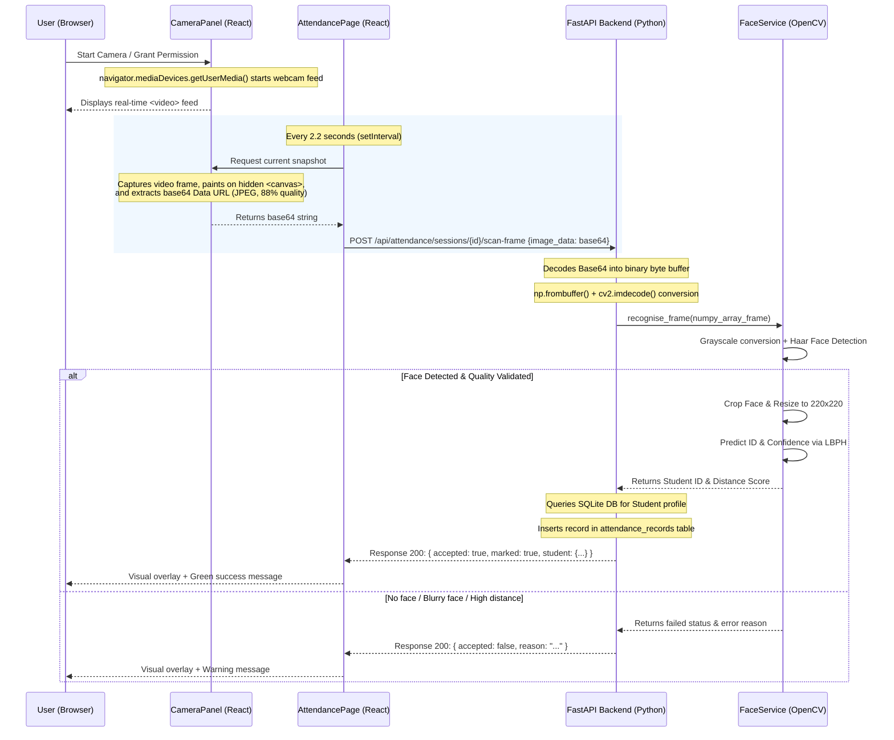

# Technical Reference Manual: Face Recognition Attendance System

This document provides an exhaustive, senior-expert breakdown of the Face Detection and Recognition Attendance System. It explains the backend, frontend, libraries, computer vision algorithms, database design, and communication flow. Use this reference guide to prepare for project demonstrations, technical reviews, and project defense questions.

---

## 1. Project Architecture & File Structure

The project is structured to offer two operation modes:
1. **Standalone CLI Mode:** Script-based workflows using `dataset_creater.py`, `trainer.py`, and `detect.py`. These scripts run directly in the terminal, utilizing local webcam windows (`cv2.imshow`) and a simplified SQLite table structure (`STUDENTS`).
2. **Enterprise Web Application Mode:** A full-stack decoupled architecture. The backend is powered by **FastAPI (Python)**, and the frontend is a modern **React (TypeScript + Vite)** application. It uses browser-side camera capture to stream images via JSON payloads to the API, and stores data in a schema-compliant relational database (`college_students` tables).

### Directory Map

```text
├── run.py                          # Orchestrator script to start both frontend & backend concurrently
├── requirements.txt                # Python backend dependencies
├── haarcascade_frontalface_default.xml # Pre-trained Viola-Jones Haar Cascade classifier parameters
├── dataset_creater.py              # CLI: Captures webcam samples and registers a user in SQLite
├── trainer.py                      # CLI: Trains the Local Binary Patterns Histograms (LBPH) model
├── detect.py                       # CLI: Runs real-time face recognition and database mapping
├── camera_check.py                 # Utility: Diagnostics to check camera availability and permissions
├── database.db                     # SQLite 3 Database file containing all tables and indices
├── dataset/                        # Storage folder for cropped face images (user.<id>.<sample_index>.jpg)
├── recognizer/                     # Storage folder for trained LBPH weights (trainingdata.yml)
├── exports/                        # Directory where exported Excel attendance reports are saved
├── app/                            # Backend API codebase (FastAPI)
│   ├── config.py                   # Central configurations (thresholds, directory paths, image sizes)
│   ├── database.py                 # SQLite helper connections, SQL migrations, and seed logic
│   ├── main.py                     # FastAPI main routes, CORS middleware, and request/response pipelines
│   ├── schemas.py                  # Pydantic data models for request validation
│   ├── validation.py               # Custom business rules (duplicate roll numbers, email validations)
│   ├── services/
│   │   └── face_service.py         # Business logic for face detection, quality assessment, and recognition
│   └── utils/
│       └── reports.py              # Logic for generating attendance reports and openpyxl exports
└── frontend/                       # Frontend UI codebase (React + TypeScript + Vite)
    ├── package.json                # npm dependencies and scripts
    ├── vite.config.ts              # Vite server & bundling configuration
    ├── index.html                  # Single-page application entry point
    └── src/
        ├── main.tsx                # React application bootstrapper
        ├── app/                    # Global state providers (AppData, Toast notifications)
        ├── components/
        │   └── camera/
        │       └── CameraPanel.tsx # Browser webcam utility (capturing frames via HTML5 Canvas)
        ├── lib/
        │   ├── api.ts              # Custom wrapper around fetch API for backend integration
        │   └── constants.ts        # Shared constants (FACE_SAMPLE_TARGET, quality boundaries)
        └── pages/                  # Views: Dashboard, Students, Enroll, Attendance, Reports
```

---

## 2. The Backend Stack (FastAPI & Python)

The backend is built in **Python** and uses the **FastAPI** framework.

### Why Python?
* **Computer Vision Dominance:** Python is the standard language for machine learning and computer vision. It has optimized native bindings for OpenCV (`cv2`) and NumPy, allowing high-performance matrix computations written in C++ to be executed through clean Python code.
* **Rapid Development:** Offers high readability, making it ideal for prototyping and writing clean, maintainable logic.

### Why FastAPI?
* **High Performance:** FastAPI is built on ASGI servers (Uvicorn) and starlette, making it one of the fastest Python frameworks available, matching NodeJS and Go in benchmark speeds.
* **Asynchronous Support:** It natively supports async/await, allowing the server to handle concurrent I/O operations (such as processing camera frame streams) without blocking other network requests.
* **Automatic API Documentation:** By leveraging Pydantic schemas, FastAPI automatically generates interactive documentation (Swagger UI at `/docs` and ReDoc at `/redoc`).
* **Robust Input Validation:** If a client sends malformed JSON (e.g., an invalid email format or missing roll number), FastAPI automatically rejects it with detailed 422 Unprocessable Entity errors, preventing bad data from hitting the database.

### Core Backend Components
1. **ASGI Server (Uvicorn):** Serves the FastAPI application (`app.main:app`) on port `8000`. It acts as the web server gateway.
2. **Pydantic Schemas (`app/schemas.py`):** Define the shapes of incoming requests and outgoing responses. For example, `StudentIn` validates that the full name is between 2 and 120 characters, the age is between 15 and 80, and other fields are sanitized (removing excess spaces).
3. **CORS Middleware:** Configured in `app/main.py` to allow cross-origin requests from the React frontend running on port `5173`.
4. **Service Layer (`app/services/face_service.py`):** Encapsulates all OpenCV operations, ensuring that database logic and network controllers remain decoupled from computer vision mechanics.

---

## 3. The Frontend Stack (React, TypeScript & Vite)

The frontend is a single-page application built on a modern React stack.

### Technologies Used
* **Vite:** A build tool that utilizes ES modules for lightning-fast hot module replacement (HMR) during development and generates highly optimized production bundles using Rollup.
* **React:** A component-based user interface library. State hooks (`useState`, `useRef`, `useEffect`) manage the UI lifecycle, camera capturing intervals, and REST API updates.
* **TypeScript:** Provides static typing, catching potential runtime errors (e.g., passing a null student reference or misspelling an API response key) during compilation.
* **Lucide React:** Used for rich, clean vector UI icons.

### Multi-Process Orchestrator (`run.py`)
To simplify starting the application, `run.py` acts as a process orchestrator:
* It uses Python's `subprocess.Popen` to launch the FastAPI backend (`uvicorn app.main:app ...`) and the frontend dev server (`npm run dev`) in parallel.
* It runs background threads (`threading.Thread`) to capture stdout/stderr from both processes and streams them to the user's terminal with `[Backend]` and `[Frontend]` labels.
* It monitors both child processes. If either server crashes, it flags the failure and shuts down the remaining process. It also captures a keyboard interrupt (Ctrl+C) to gracefully terminate both servers.

---

## 4. How the Frontend & Backend Connect (Frame-Data Pipeline)

Rather than forcing the backend to deal with complex video capture streams over network endpoints, the system utilizes a **Client-Driven Capture Pipeline**. The web browser captures frames locally, and the backend performs the computer vision calculations.

### The Camera Capture Flow (Base64 Transfer)



### The Base64 Extraction Mechanics (`CameraPanel.tsx`)
1. **User Media Access:** The browser requests the webcam stream via:
   ```typescript
   navigator.mediaDevices.getUserMedia({ video: { width: 1280, height: 720 }, audio: false })
   ```
   This loads the stream into a `<video>` element.
2. **Canvas Painting:** When a frame is requested, the application programmatically creates an in-memory `<canvas>` element:
   ```typescript
   const canvas = document.createElement("canvas");
   canvas.width = video.videoWidth;   // 1280
   canvas.height = video.videoHeight; // 720
   const context = canvas.getContext("2d");
   context.drawImage(video, 0, 0, canvas.width, canvas.height);
   ```
3. **Data Encoding:** The context encodes the canvas pixels into a JPEG string, formatted as a Base64 Data URL:
   ```typescript
   return canvas.toDataURL("image/jpeg", 0.88); // returns "data:image/jpeg;base64,/9j/4AAQSkZ..."
   ```
4. **Backend Decoding (`face_service.py`):** The backend receives this string, strips the `data:image/jpeg;base64,` header, decodes the base64 characters into binary bytes, and maps them into a NumPy pixel matrix:
   ```python
   raw_bytes = base64.b64decode(base64_string)
   pixel_array = np.frombuffer(raw_bytes, dtype=np.uint8)
   cv_frame = cv2.imdecode(pixel_array, cv2.IMREAD_COLOR)
   ```

---

## 5. The Computer Vision Pipeline (The Mathematical Core)

The face recognition logic is broken into four distinct processing stages: **Detection**, **Normalization**, **Quality Assessment**, and **Prediction**.


### Stage 1: Face Detection (Viola-Jones Haar Cascade)
* **What is it?** Face detection locates the position of human faces within a larger image frame.
* **How it works:** It uses Haar-like features (rectangular window filters that calculate the differences between pixel intensities of adjacent rectangular regions). Because facial areas (like eyes and nose bridges) contain consistent light/dark patterns, these features can detect a face.
* **Key Components:**
  * **Integral Images:** Computes pixel sums in constant time $O(1)$, regardless of window size.
  * **AdaBoost:** Selects a subset of key features from millions of possibilities.
  * **Cascading:** Links classifiers in stages. If a background window fails stage 1, it is discarded immediately, saving CPU cycles.
* **Code Implementation (`face_service.py`):**
  ```python
  faces = self.cascade.detectMultiScale(
      gray,
      scaleFactor=1.2,      # Scales the image by 20% at each step to detect faces of varying sizes
      minNeighbors=6,       # Higher value = fewer false positives (needs 6 overlapping boxes to confirm a face)
      minSize=(90, 90)      # Ignores tiny details or background artifacts smaller than 90x90 px
  )
  ```

### Stage 2: Face Normalization
The machine learning model cannot compare images of different sizes, aspect ratios, or color structures.
1. **Grayscale Conversion:** Grayscale simplifies the image from three channels (Blue, Green, Red) to one channel (Luminescence). This isolates structural gradients, reduces memory usage, and eliminates noise from color variations.
2. **Cropping:** The detected face boundary `(x, y, w, h)` is cropped out: `cropped = gray[y : y + h, x : x + w]`.
3. **Resizing:** The cropped face is resized to a standardized dimension of **220x220 pixels** using area interpolation (`cv2.INTER_AREA`), which is ideal for downsampling:
   ```python
   cv2.resize(cropped, (220, 220), interpolation=cv2.INTER_AREA)
   ```

### Stage 3: Real-Time Quality Assessment
To ensure low-quality photos do not degrade training or recognition accuracy, every normalized face passes through a quality filter before being sent to the model:

#### 1. Sharpness Calculation (Laplacian Variance)
Blurry images distort local binary patterns. Sharpness is measured by calculating the variance of the Laplacian of the image. The Laplacian acts as a high-pass filter highlight edges:
$$\Delta f = \frac{\partial^2 f}{\partial x^2} + \frac{\partial^2 f}{\partial y^2}$$
* In digital image processing, a sharp image has a high edge variance (large changes in pixel intensity). A blurry image contains very low variance.
* **Code:**
  ```python
  sharpness = float(cv2.Laplacian(normalized_face, cv2.CV_64F).var())
  ```
  If `sharpness < 35.0` (`MIN_SHARPNESS`), the system rejects the image, asking the user to hold still.

#### 2. Brightness Calculation (Mean Pixel Intensity)
Poor lighting hinders recognition. Brightness is measured by calculating the mean pixel value of the grayscale face:
$$\text{Brightness} = \frac{1}{W \times H} \sum_{x=0}^{W-1} \sum_{y=0}^{H-1} I(x, y)$$
* **Code:**
  ```python
  brightness = float(np.mean(normalized_face))
  ```
  If `brightness < 45.0` (`MIN_BRIGHTNESS`), the lighting is too dark. If `brightness > 215.0` (`MAX_BRIGHTNESS`), the image is overexposed. In either case, the frame is rejected.

### Stage 4: Face Recognition (LBPH Algorithm)
The system uses the **Local Binary Patterns Histograms (LBPH)** algorithm.

#### 1. Mathematical Underpinnings (LBP Operator)
For each pixel in the 220x220 face image, the LBP operator compares its intensity with its 8 surrounding neighbors in a $3\times3$ grid:
$$\text{LBP}(x_c, y_c) = \sum_{p=0}^{7} s(i_p - i_c) 2^p$$
Where:
* $i_c$ is the intensity value of the center pixel $(x_c, y_c)$.
* $i_p$ is the intensity value of the $p$-th neighbor pixel.
* $s(x)$ is a threshold step function:
  $$s(x) = \begin{cases} 1 & x \ge 0 \\ 0 & x < 0 \end{cases}$$

For example, if the center pixel intensity is $90$:
```text
Neighbor intensities:          Thresholding against 90:       Binary Weights:
  | 85 | 96 | 90 |               | 0 | 1 | 1 |                 |   1 |   2 |   4 |
  | 92 | 90 | 88 |     ===>      | 1 | c | 0 |       ===>      |   8 |   c |  16 |
  | 79 | 98 | 84 |               | 0 | 1 | 0 |                 |  32 |  64 | 128 |
```
Calculating the decimal value:
$$\text{LBP} = (0 \times 1) + (1 \times 2) + (1 \times 4) + (1 \times 8) + (0 \times 16) + (0 \times 32) + (1 \times 64) + (0 \times 128) = 2 + 4 + 8 + 64 = 78$$
The center pixel value $90$ is replaced with the LBP code **$78$**. This process is highly resistant to lighting shifts because the relative changes between neighboring pixels remain stable even if overall brightness increases or decreases.

#### 2. Grid Histograms & Feature Vector Assembly
1. The 220x220 LBP image is divided into equal local grid cells (typically $8\times8$ subregions).
2. For each subregion, a histogram of LBP codes is calculated. Each histogram represents the frequency of local structures (such as corners, flat zones, or edges) in that cell.
3. These cell histograms are concatenated in order into a single, high-dimensional global histogram vector, which forms the face's unique feature map.

#### 3. Training & Weight Storage (`trainer.py` / `/api/model/train`)
During training, the system processes all saved face samples (`dataset/user.<id>.<sample_index>.jpg`), generates their global histograms, and saves them alongside their respective integer IDs into a YAML file (`recognizer/trainingdata.yml`).

#### 4. Inference & Distance Metrics (`detect.py` / `/api/attendance/scan-frame`)
When an unknown face is scanned:
1. The system calculates its LBP histogram.
2. It compares this histogram against the trained histograms in the YAML file.
3. It uses a distance metric (typically **Chi-Square Distance** $\chi^2$) to measure dissimilarity:
   $$\chi^2(P, Q) = \sum_{i} \frac{(P_i - Q_i)^2}{P_i + Q_i}$$
   Where $P$ and $Q$ are the two histogram vectors.
4. **The Confidence Paradox:** The value returned by `predict()` is the calculated distance score. Therefore, **a lower score represents a closer match**.
   * A score of `0` means the histograms are identical.
   * If the distance is below the `RECOGNITION_THRESHOLD` of `72.0`, the system confirms the match. If the distance is above `72.0`, it rejects the recognition attempt as an unconfident match.

---

## 6. The Database Stack (SQLite)

The system uses **SQLite 3** to manage persistent data.

### Why SQLite?
* **Serverless and Zero-Configuration:** Unlike MySQL or PostgreSQL, SQLite reads and writes directly to a single file (`database.db`) in the workspace. There is no server process to install, manage, or configure, making the project portable.
* **ACID Compliant:** Fully supports Atomic, Consistent, Isolated, and Durable transactions. If the backend loses power mid-write, the database preserves integrity, avoiding corrupted data.
* **Fast and Lightweight:** Excellent read performance on local filesystems, with minimal memory and CPU overhead.
* **Foreign Key Support:** Enforced at the application level on startup via `PRAGMA foreign_keys = ON`, ensuring automatic cascades and database consistency.

### Database Tables Schema

```mermaid
erDiagram
    college_students ||--o{ face_samples : "has"
    college_students ||--o{ attendance_records : "marked in"
    college_students ||--o{ recognition_events : "evaluated in"
    attendance_sessions ||--o{ attendance_records : "contains"
    attendance_sessions ||--o{ recognition_events : "logs"

    college_students {
        INTEGER id PK
        TEXT roll_number UNIQUE
        TEXT full_name
        INTEGER age
        TEXT email
        TEXT phone
        TEXT department
        TEXT program
        TEXT academic_year
        TEXT semester
        TEXT section
        TEXT status
        TEXT created_at
        TEXT updated_at
    }

    face_samples {
        INTEGER id PK
        INTEGER student_id FK
        TEXT file_path UNIQUE
        REAL sharpness
        REAL brightness
        TEXT quality_label
        TEXT captured_at
    }

    model_versions {
        INTEGER id PK
        TEXT model_path
        INTEGER student_count
        INTEGER sample_count
        TEXT status
        TEXT notes
        TEXT trained_at
    }

    attendance_sessions {
        INTEGER id PK
        TEXT attendance_date
        TEXT title
        TEXT department
        TEXT program
        TEXT academic_year
        TEXT semester
        TEXT section
        TEXT status
        TEXT started_at
        TEXT ended_at
    }

    attendance_records {
        INTEGER id PK
        INTEGER session_id FK
        INTEGER student_id FK
        TEXT status
        REAL confidence
        TEXT marked_at
    }

    recognition_events {
        INTEGER id PK
        INTEGER session_id FK
        INTEGER predicted_student_id FK
        REAL confidence
        INTEGER accepted
        TEXT reason
        TEXT created_at
    }
```

#### 1. Table: `college_students`
Stores core student profiles.
```sql
CREATE TABLE college_students (
    id INTEGER PRIMARY KEY,
    roll_number TEXT NOT NULL UNIQUE,
    full_name TEXT NOT NULL,
    age INTEGER,
    email TEXT,
    phone TEXT,
    department TEXT NOT NULL DEFAULT '',
    program TEXT NOT NULL DEFAULT '',
    academic_year TEXT NOT NULL DEFAULT '',
    semester TEXT NOT NULL DEFAULT '',
    section TEXT NOT NULL DEFAULT '',
    status TEXT NOT NULL DEFAULT 'active', -- 'active' or 'inactive'
    created_at TEXT NOT NULL,
    updated_at TEXT NOT NULL
);
```

#### 2. Table: `face_samples`
Tracks saved training photos. If a student is deleted, their face sample rows cascade-delete automatically.
```sql
CREATE TABLE face_samples (
    id INTEGER PRIMARY KEY AUTOINCREMENT,
    student_id INTEGER NOT NULL,
    file_path TEXT NOT NULL UNIQUE,
    sharpness REAL NOT NULL,
    brightness REAL NOT NULL,
    quality_label TEXT NOT NULL,
    captured_at TEXT NOT NULL,
    FOREIGN KEY (student_id) REFERENCES college_students(id) ON DELETE CASCADE
);
```

#### 3. Table: `model_versions`
Logs ML training iterations.
```sql
CREATE TABLE model_versions (
    id INTEGER PRIMARY KEY AUTOINCREMENT,
    model_path TEXT NOT NULL,
    student_count INTEGER NOT NULL,
    sample_count INTEGER NOT NULL,
    status TEXT NOT NULL,                  -- 'ready', 'training', 'stale'
    notes TEXT,
    trained_at TEXT NOT NULL
);
```

#### 4. Table: `attendance_sessions`
Tracks active and historical daily attendance sessions.
```sql
CREATE TABLE attendance_sessions (
    id INTEGER PRIMARY KEY AUTOINCREMENT,
    attendance_date TEXT NOT NULL,
    title TEXT NOT NULL,
    department TEXT NOT NULL DEFAULT '',
    program TEXT NOT NULL DEFAULT '',
    academic_year TEXT NOT NULL DEFAULT '',
    semester TEXT NOT NULL DEFAULT '',
    section TEXT NOT NULL DEFAULT '',
    status TEXT NOT NULL DEFAULT 'active', -- 'active' or 'completed'
    started_at TEXT NOT NULL,
    ended_at TEXT
);
```

#### 5. Table: `attendance_records`
Links students to attendance sessions. A unique constraint ensures a student can only be marked present once per session.
```sql
CREATE TABLE attendance_records (
    id INTEGER PRIMARY KEY AUTOINCREMENT,
    session_id INTEGER NOT NULL,
    student_id INTEGER NOT NULL,
    status TEXT NOT NULL DEFAULT 'present',
    confidence REAL NOT NULL,              -- Stores the LBPH distance metric
    marked_at TEXT NOT NULL,
    FOREIGN KEY (session_id) REFERENCES attendance_sessions(id) ON DELETE CASCADE,
    FOREIGN KEY (student_id) REFERENCES college_students(id) ON DELETE CASCADE,
    UNIQUE(session_id, student_id)
);
```

#### 6. Table: `recognition_events`
Stores audit logs of every recognition attempt (successful and unsuccessful).
```sql
CREATE TABLE recognition_events (
    id INTEGER PRIMARY KEY AUTOINCREMENT,
    session_id INTEGER,
    predicted_student_id INTEGER,
    confidence REAL,
    accepted INTEGER NOT NULL,            -- 1 (True) or 0 (False)
    reason TEXT NOT NULL,                 -- e.g., "Recognized", "No face detected", "Blurry face"
    created_at TEXT NOT NULL,
    FOREIGN KEY (session_id) REFERENCES attendance_sessions(id) ON DELETE SET NULL,
    FOREIGN KEY (predicted_student_id) REFERENCES college_students(id) ON DELETE SET NULL
);
```

### Performance Optimization: Indexes
To guarantee fast query responses as the database grows, indexes are placed on foreign key columns and frequently filtered columns:
```sql
-- Speeds up filtering students by their department and semester groups
CREATE INDEX idx_students_group ON college_students(department, program, academic_year, semester, section);

-- Speeds up report generation by sorting by session dates
CREATE INDEX idx_attendance_sessions_date ON attendance_sessions(attendance_date);

-- Speeds up checking if a student is marked present in a session
CREATE INDEX idx_attendance_records_session ON attendance_records(session_id);

-- Speeds up looking up recognition history logs for a session
CREATE INDEX idx_recognition_events_session ON recognition_events(session_id);
```

### Standalone CLI Table Migration (`STUDENTS`)
To maintain compatibility with the standalone CLI scripts (`dataset_creater.py`, `detect.py`), the backend initialization checks if the legacy `STUDENTS` table exists:
* If found, the system reads its rows (`Id`, `Name`, `age`).
* It inserts those students into `college_students`, automatically prefixing their roll numbers as `LEGACY-<Id>` if they don't have one.
* It maps existing images in the `dataset/` directory back into the new `face_samples` table with a quality label of `Legacy`. This maintains compatibility between the CLI and the Web App.

---

## 7. Anticipated Viva & Project Defense Questions

### Q1: Why did you choose LBPH over deep learning models like FaceNet or CNNs?
**Answer:** LBPH is computationally efficient and requires no specialized GPU hardware, making it ideal for edge computing deployments (such as a Raspberry Pi). Additionally, deep learning networks require thousands of images per class to train, whereas LBPH performs well with only 30-35 samples per user, which can be captured in a few seconds.

### Q2: What does a confidence score of 50 mean in your system? Is it better or worse than 20?
**Answer:** A confidence score of 50 is **worse** than 20. In LBPH, the confidence score represents the Chi-Square distance between the histograms of the captured face and the trained database. A lower distance indicates that the two histograms are more similar. A score of `0` represents a perfect match.

### Q3: What is the purpose of the Laplacian operator in your face service?
**Answer:** The Laplacian operator is a 2D isotropic measure of the 2nd spatial derivative of an image. It highlights regions of rapid intensity change, such as lines and edges. By calculating the variance of the Laplacian, we get a sharpness score. If the variance is low (below `35.0`), it indicates the image lacks sharp edges and is blurry, allowing us to reject it before saving it as a bad sample.

### Q4: How does your web app support concurrent camera streams without crashing or locking the webcam?
**Answer:** Web browsers access the webcam locally via the standard HTML5 MediaDevices API (`getUserMedia`). The frontend captures frames on the client side, converts them to base64 strings, and sends them to the API. This shifts the video capture overhead to the client's browser, freeing the backend from keeping persistent video connections open. For server-side video operations (like `/api/camera/stream`), the backend uses a thread-safe mutex lock (`Lock()`) to prevent multiple API requests from accessing the OpenCV camera resource concurrently.

### Q5: What database constraints prevent a student from being marked present twice in the same attendance session?
**Answer:** The database enforces a `UNIQUE(session_id, student_id)` constraint on the `attendance_records` table. Any attempt to write a duplicate row for the same student within a single session triggers an SQL constraint violation error, which the backend catches and handles.

### Q6: Why is `cv2.COLOR_BGR2GRAY` conversion essential for face detection and recognition?
**Answer:** Color channels (Blue, Green, Red) do not provide structural facial geometry details and are highly sensitive to changing colored lights. Converting the frame to grayscale isolates the structural luminance intensity values, reduces the pixel input space from three dimensions to one dimension, and decreases processing memory and execution time.

### Q7: If a student changes their hairstyle or wears glasses, will LBPH still recognize them?
**Answer:** Yes, because the LBPH classifier does not analyze the face as a single global shape. It divides the LBP-encoded face into an $8\times8$ grid and analyzes local patterns. Therefore, changes in a localized region (like hair) do not completely distort the global histogram vector representing the rest of the facial structures (eyes, nose, mouth shape). However, wearing thick dark glasses might obscure eye patterns, which is why capturing training samples under different facial conditions is recommended.
