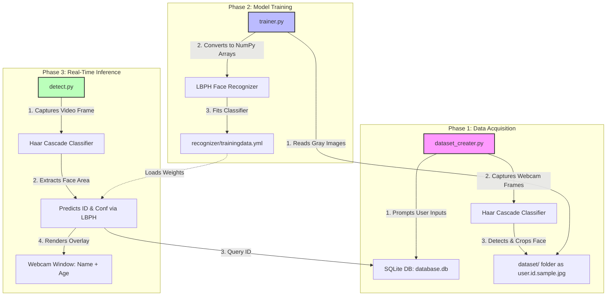

# College Viva & Technical Interview Guide: Face Recognition Project

This guide provides a comprehensive technical breakdown of your Face Detection and Recognition project. It is structured from a senior developer's perspective to prepare you for college vivas, technical reviews, and project defense interviews.

---

## 1. Architectural Design & Workflow Pipeline

The project is structured into three clean, decoupled phases. This modularity follows software engineering best practices: **Data Collection**, **Model Training**, and **Inference**.

### Why Decouple Into 3 Scripts?
- **Separation of Concerns (SoC):** You don't want to retrain the model every time you run the webcam detector. Similarly, you only need to run the dataset creator when adding a new user.
- **Resource Management:** Splitting the files ensures each script runs only the necessary code, keeping memory usage minimal.
- **Scalability:** You can easily swap the trainer or the detector (e.g., replacing LBPH with a Deep Learning CNN model) without breaking the other components.

---

## 2. Deep Dive: Core Computer Vision Concepts

To ace your viva, you must explain the underlying algorithms rather than just saying "we used OpenCV".

### Concept A: Face Detection using Viola-Jones (Haar Cascades)
In [dataset_creater.py](file:///Users/ishan/Face%20Detection%20Project%20Python/dataset_creater.py) and [detect.py](file:///Users/ishan/Face%20Detection%20Project%20Python/detect.py), you instantiate:
`cv2.CascadeClassifier('haarcascade_frontalface_default.xml')`

#### How it works:
1. **Haar-like Features:** These are rectangular filters (edge features, line features, four-rectangle features) that compute the difference between sum of pixels in dark and light regions. For example, the bridge of the nose is typically lighter than the eye sockets.
2. **Integral Images:** Calculating pixel sums in sub-rectangles is slow. Viola-Jones uses **Integral Images** (where each pixel represents the sum of pixels above and to the left of it), enabling feature computation in constant time $O(1)$ regardless of size.
3. **AdaBoost (Adaptive Boosting):** A cascade has millions of potential features. AdaBoost selects a small subset of features that are highly discriminative for faces and discards irrelevant ones.
4. **Cascading Classifiers:** The algorithm uses a chain of stages. In each stage, a simple classifier determines if the window *could* contain a face. If any stage rejects it, the window is skipped instantly. This saves CPU cycles by filtering out background areas immediately.

---

### Concept B: Face Recognition using LBPH (Local Binary Patterns Histograms)
In [trainer.py](file:///Users/ishan/Face%20Detection%20Project%20Python/trainer.py), you use:
`cv2.face.LBPHFaceRecognizer_create()`

Unlike algorithms like Eigenfaces or Fisherfaces, LBPH is highly resistant to local illumination changes because it focuses on **micro-texture**.

#### The Math & Processing Pipeline:
1. **LBP Operator (Local Binary Pattern):**
   - The algorithm takes a $3\times3$ pixel window.
   - It compares the intensity of the center pixel with its 8 neighbors.
   - If a neighbor's value $\ge$ the center pixel, it is marked as `1`, otherwise `0`.
   - This gives an 8-bit binary code (e.g., `10011010`), which is converted to decimal (e.g., `154`).
   
   $$\text{LBP}(x_c, y_c) = \sum_{p=0}^{7} s(i_p - i_c) 2^p \quad \text{where} \quad s(x) = \begin{cases} 1 & x \ge 0 \\ 0 & x < 0 \end{cases}$$

2. **Dividing into Grids (Spatial Histograms):**
   - The resulting LBP image is divided into $N\times N$ local regions (cells), typically $8\times8$.
   - A histogram is generated for each cell. The histogram represents the frequency of local patterns (edges, lines, flat regions) in that cell.

3. **Feature Vector:**
   - The cell histograms are concatenated into a single, high-dimensional global histogram representing the entire face.

4. **Matching & Prediction:**
   - When an unknown face is captured in `detect.py`, its histogram is generated.
   - It is compared against the trained histograms in `trainingdata.yml` using distance metrics (typically **Chi-Square Distance** or **Euclidean Distance**).
   - The face ID corresponding to the minimum distance (best match) is returned, along with the distance as the **Confidence** value.
   - **Crucial Note for Viva:** In LBPH, **lower confidence/distance is better**. A confidence score of `0` means an exact match.

---

## 3. Advantages, Disadvantages, & Why You Chose This Project

### Why did you choose/create this specific setup?
1. **Edge-Friendly (CPU Optimized):** You chose LBPH and Haar Cascades because they do not require heavy GPUs. They run smoothly on lightweight CPUs, making this code deployable on embedded devices (e.g., Raspberry Pi, Jetson Nano).
2. **Small Dataset Support:** Deep learning models (like CNNs) require thousands of images per subject to train. LBPH performs exceptionally well with just 20 images per user.
3. **Structured Storage:** Integrating SQLite provides a structured, ACID-compliant database showing how computer vision can interface with enterprise-ready backends.

### Advantages
- **Real-Time Speed:** Extremely high frame rates (FPS) on standard laptop hardware.
- **Offline Capabilities:** No external APIs or cloud services (like AWS Rekognition or Azure Face API) are needed, ensuring 100% data privacy.
- **Lightweight Model Size:** The trained weights are stored in a small YAML file (~3.5MB), keeping deployment footprints minimal.

### Disadvantages
- **Illumination Sensitivity:** Since Haar Cascades and LBPH rely heavily on pixel contrasts, dim lighting or shadow changes degrade recognition accuracy.
- **Angle Variations:** LBPH is primarily optimized for frontal face recognition. It struggles with extreme side profiles (yaw, pitch, roll).
- **Security Limitation (No Spoofing Detection):** The model cannot distinguish between a real face and a high-resolution printed photo of the user.

---

## 4. Viva / Interview Questions and Answers

### Q1: What is the difference between Face Detection and Face Recognition?
* **Answer:** Face detection is the process of identifying *whether* there is a face in an image and finding its location (bounding box). Face recognition is identifying *whose* face it is (classification/matching). In this project, **Haar Cascade** handles detection, and **LBPH** handles recognition.

### Q2: What is the significance of converting the image to grayscale (`cv2.COLOR_BGR2GRAY`)?
* **Answer:** Color (RGB/BGR) does not contribute much to face structure or shape. Converting to grayscale reduces the image data from 3 channels (Red, Green, Blue) to 1 channel. This decreases processing time, reduces memory usage, and eliminates noise caused by varying color tones.

### Q3: Why does `recognizer.predict()` return a distance, and what does it mean?
* **Answer:** It returns `(id, confidence)`. The confidence value represents the distance (dissimilarity) between the query histogram and the closest trained histogram. **A lower confidence score means a stronger match.** If the value is above a certain threshold (e.g., 80 or 100), the system should treat the face as "Unknown".

### Q4: Why is there an SQLite database in this project?
* **Answer:** The machine learning model only recognizes integer labels (`Id`). It does not store human details. We map the predicted integer `Id` to student profiles (`Name`, `Age`) in the relational database (`database.db`) to display human-readable information on the screen.

---

## 5. Real-World Use Cases & Future Scope

### Real-World Use Cases:
1. **Automated Attendance System:** Installed in schools/offices to mark attendance when students/employees walk past a camera.
2. **Access Control:** Unlocking office doors or home locks based on face identification.
3. **Customer Analytics:** Identifying repeat customers in retail stores to fetch their preferences.

### Future Scope (How you could upgrade this project):
1. **Liveness Detection:** Integrate texture analysis or blink detection (using facial landmarks) to ensure a live human is in front of the camera, preventing spoofing via photos.
2. **Deep Learning Upgrades:** Swap the LBPH recognizer with a deep-learning embedding model, such as **FaceNet** or **Dlib's ResNet**, utilizing cosine similarity or Euclidean distance on 128-dimensional face vectors.
3. **Cloud Synchronization:** Sync the local SQLite database and model weights to a cloud service (e.g., AWS RDS or Firebase) to allow multiple cameras at different locations to identify faces using the same database.
